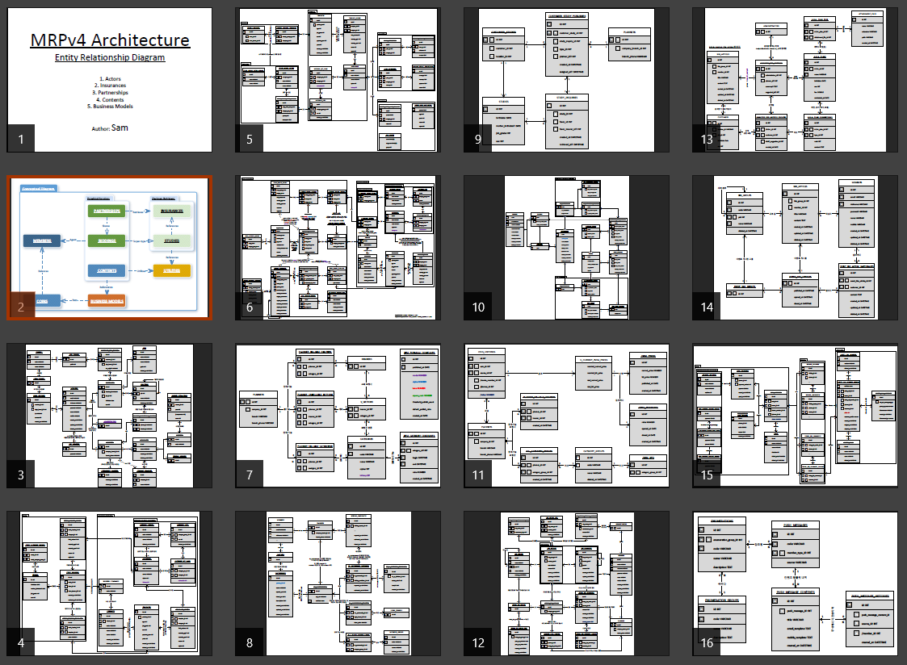
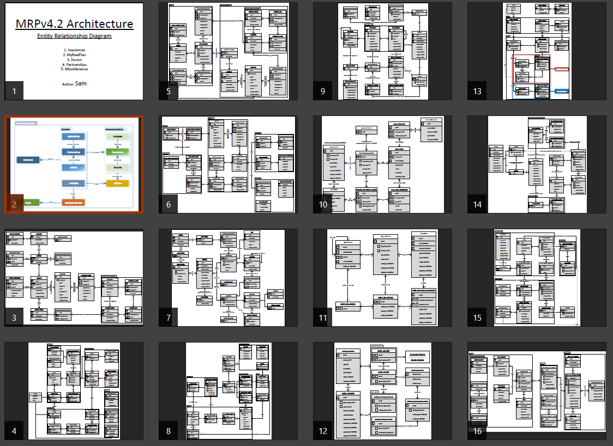
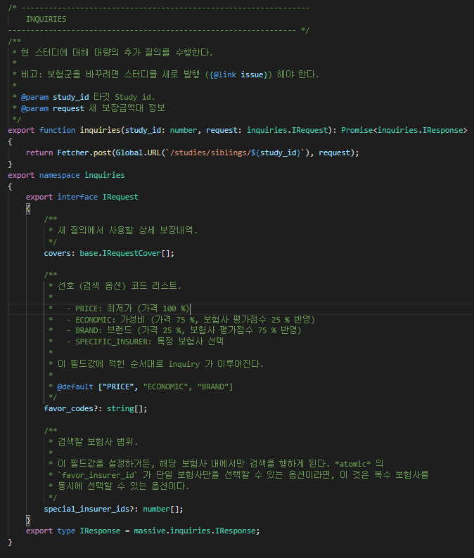
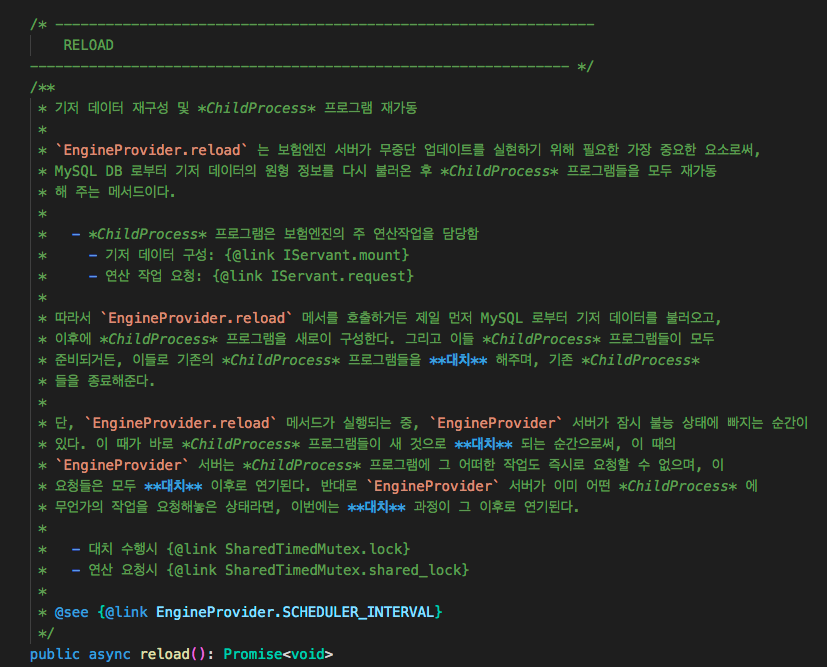

# 2020 년 상반기, 개발자 모집요강 초안
## 개요
모집 요강을 간단하게 요약하고, 아래와 같은 예시 문구로 사람들의 이목을 끌 것.
  - 중견/대기업급 처우
  - 체계적이고 합리적인 개발 문화
  - 칼퇴 보장

강조 포인트, 전달하고자 하는 메시지
  - 선진 개발 문화
    - Junior 에게는 좋은 배움터
    - Senior 에게는 좋은 워라벨
  - 업계 기준 상급 대우
  - 합리적인 개발팀 운영

비고: 사훈이나 10 계명, 이런 거 적지 말 것

## 1. 아이지넷
아래 소단원들은 예시에 불과할 뿐이니, 이 단원을 마음대로 바꿔써도 좋다.

### 1.1. 회사 소개
아이지넷에 대하여 간략히 소개할 것.

### 1.2. 사업 내용
아이지넷이 영위하는 사업과 그에 대한 비전에 대하여 서술할 것.

### 1.3. 기타
아이지넷이 개발자를 모집하려는 이유 및 처우에 대하여 안내할 것.

## 2. 인재상
### 2.1. 공통사항
#### 2.1.1. 기본 소양
아이지넷이 바라는 개발자의 기본 소양을 요약하면 아래와 같습니다.

  - SW 관련 전공자이며, 영어 독해가 가능하다.
    - 전공자가 아니거든, 
    - SW 공학에 대해 튼튼한 기초를 가지고 있을 것
  - 다음 중 하나에 해당하는 사람이거나,
    - [Github](https://github.com) Project 또는 Portfolio 등이 있다.
    - 기술 블로그나 노트 등을 통하여, 꾸준히 자기 개발을 해 왔음을 증명할 수 있다.
    - 자신이 참여한 프로젝트에 대하여 일목 요연하게 이야기할 수 있다.
  - 또는 이외의 방법으로 자신의 역량을 증명할 수 있다.

아이지넷의 개발팀은 SW 공학에서 흔히 말하는 표준 개발론을 따릅니다. 즉, 하드코딩을 지양하고 정제된 설계와 명확한 정의를 지향합니다. 따라서 아이지넷은 개발자들에게 기본 소양으로써, 이러한 SW 공학에 대한 기초 지식들을 요합니다. 

그리고 아이지넷은 개발자들에게, 여타 IT 회사들이 그러하듯, [구글](https://google.com)이나 [깃허브](https://github.com) 및 [스택오버플로](https://stackoverflow.com) 등을 사용하고, 영어 원문으로 된 기술 블로그나 책을 읽는 데 지장이 없을 정도의 독해력을 요합니다. 이 정도면 아마도 평범한 고등학생의 수준이 아닐까 그리 생각합니다.

마지막으로 아이지넷은 개발팀 개개인의 역량을 정확히 파악하여 적재적소에 배치하고 싶어합니다. 따라서 지원자 분들께서, [깃허브](https://github.com) 계정이나 포트폴리오 문서 등, 자신의 역량을 증명할 수 있는 수단을 갖춰놓으신 분들을 우선 면담하여 채용하고자 합니다. 위 사항에 해당하지 않는 분들은, 기술면접과 코딩 테스트 등의 검증 과정을 한 번 더 거치고자 합니다.

#### 2.1.2. 우대 사항
아이지넷은 다음 소양을 갖춘 개발자를 우대하여, 무조건 채용하고자 합니다.

  - 하드코딩을 지양하며, 정제된 설계와 개발을 선호하는 사람
    - 코드부터 짜기보단 필기를 하며 개요를 정리하는 사람
    - **Architecture** 를 수립할 수 있고, 이를 잘 실천하며 꾸준히 개선할 수 있는 사람
  - 완성작을 돌아보며,
    - "이랬으면 좋았을텐데, 저랬으면 더 낫지 않았을까?"
    - 한 번 더 생각해보고 반성하여,
    - 다음 프로젝트에 이를 개선할 수 있는 사람
  - 프로젝트를 원점에서부터 수 차례 반복 재구성 해 본 경험이 있는 사람
  - 알고리즘 연구/개발 및 최적화에 능숙한 분 (특별 우대)

아이지넷은 하드 코딩을 지양하며, 체계적인 설계 및 정제된 타입 정의를 지향합니다. 즉, SW 공학에서 흔히 말하는 표준 개발론이 곧, 아이지넷의 개발팀이 목표하는 지향점입니다. 단, 표준 개발론을 추구한다면서 막상 공염불이 그쳤던 다른 IT 회사들과는 다르게, 아이지넷은 이를 오래도록 실천해왔습니다. 그리고 그 목표도 상당수 달성해오고 있습니다.

따라서 아이지넷이 우대하는 개발자는 자연스레, 이런 표준 개발에 능숙하거나 또는 그만한 소질과 잠재력을 갖춘 개발자입니다. 하드코딩으로 만드는 프로그램보다 표준 개발론으로 신중한 설계와 엄밀한 타입 정의로 만든 프로그램이 실제로도 더 빨리, 그리고 안정적으로 만들어질 수 있다는 걸 마음속 깊이 이해하고 있는 개발자라면, 아이지넷은 언제든지 환영합니다.

더불어 아키텍처 설계나 자료구조 정의에 능숙하지는 못하더라도, 이미 완성된 프로젝트를 복기해보면서 "이랬으면 더 좋았겠다" 라고 스스로 돌아보고 차후에 개선할 수 있는 개발자 분들도 환영합니다. 단순 복기 및 반성에 그치지 않고, (아마도 개인) 프로젝트를 수 차례 반복 재구성 함으로써 꾸준히 개선해 본 경험이 있는 분들도 두 팔 벌려 환영합니다.

마지막으로 저희 아이지넷은 보험과 연관 금융 산업에 대해, 다방면으로 알고리즘을 연구하고 개발하며 최적화합니다. 본인이 (금융)수학을 잘 하거나 알고리즘 연구/개발 및 최적화에 능숙하시다면, 지체말고 지원해주십시오. 이런 분들은 아이지넷이 특별 대우해드리겠습니다.

#### 2.1.3. 현재 기술셋
아이지넷의 현재 기술셋은 다음과 같습니다.

  - TypeScript
    - NodeJS
    - React
    - React Native
  - MySQL
  - AWS

보시다시피, 아이지넷의 기술셋은 매우 간결합니다. 아이지넷에서 제작하는 모든 프로그램은, 서버와 프론트를 불문하고, TypeScript 로 작성됩니다. 그리고 DBMS 로 MySQL 을 사용하며, 네트워크 인프라 관리에 AWS 를 이용합니다.

다만, 지원자께서 반드시 위 언어나 도구 등에 이미 능숙하신 상태이실 필요는 없습니다. 구태여 TypeScript 나 MySQL 이 아니더라도, Java 나 Oracle 등의 유사 언어와 DBMS 를 접해보셨으면 됩니다. 지원자님께서 프로그래머의 기본적 소양을 갖추신 분이라면 능히 채용되실 터이니, 이후에 차차 공부해나가시면 됩니다.

더불어 위 기술셋은 '현재' 아이지넷이 사용하고 있는 기술셋일 뿐, 미래에도 절대적인 척도는 아닙니다. 필요에 따라 NoSQL 을 도입해야 할 수도 있고, 퍼포먼스 최적화가 필요하여 TypeScript 로 제작된 기능의 일부를 C++ 로 이관해야 할 수도 있습니다. 대신 그러한 때가 오거든, 아이지넷은 개발자들을 무턱대고 닥달하는 비합리적인 회사가 되기보다는, 구성원들에게 충분할만큼의 연구와 스터디 시간을 보장하는 합리적인 회사가 되고자 합니다.

### 2.2. 역할에 따른 구분
아이지넷의 웹 개발은 **풀스택**을 지향합니다.

아이지넷은 개발자들을 채용함에 있어, 그들의 역할을 '서버 개발자' 니 '웹 개발자' 니 하는 용어로 구분하기는 하되, 그것이 절대적이지는 않습니다. 그저 개발자 개개인의 성향상 '서버를 더 잘 다루는 개발자', '웹 개발을 더 잘 하는 사람' 정도로 구분하려고 합니다. 고로 아이지넷의 백 엔드 개발자는 경우에 따라 웹이나 앱을 개발할 수도 있으며, 웹이나 앱 개발자 역시 상황에 따라 서버 프로그램을 수정해야 할 수도 있습니다.

다만, 지원자께서 반드시 현재 **풀스택**을 달성하신 상태이실 필요는 없습니다. 현재 **풀스택**개발자가 아니시라도, 저희가 **풀스택**개발자가 될 수 있도록 도와드리겠습니다. 저희 아이지넷은 표준 설계 및 표준 개발 절차를 준수하며, 모든 프로그램을 TypeScript 로 작성하고 있습니다. 따라서 아이지넷은 그 어느 회사보다도 풀스택 개발을 익히기 좋은 환경일 뿐더러, 약속컨대 **풀스택**능력을 충분히 함양하실 수 있도록, 아낌없이 지원해드릴 것입니다.

#### 2.2.1. Server Developer
아이지넷 서버 개발자의 주 역할은 아래와 같습니다.

  - API 설계 및 개발
  - DB 설계 및 개발
  - 서버 인프라 관리
  - 알고리즘 개발 및 최적화 (특별 우대)

아이지넷은 서버 개발자가 DB 테이블을 아리송하게 설계하거나 API 스펙이 부실하면, 그 영향은 프론트와 서비스에 미치고, 종국에는 서비스 전반을 위태롭게 만든다고 생각합니다. 또한 아이지넷은, 하드코딩으로 만드는 프로그램보다 표준 개발론으로 신중한 설계와 엄밀한 타입 정의로 만든 프로그램이 실제로도 더 빨리, 그리고 안정적으로 만들어질 수 있다고 믿습니다.

따라서 아이지넷이 서버 개발자의 역량, 그 중에서도 특히 중점적으로 보는 소양이 바로, **설계** 능력입니다. 요구사항을 듣고 이를 알맞게 정리하여 아키텍처로 근사하게 풀어내는 능력, 이 것이 서버 개발자에게 아이지넷이 원하는 제 1 의 덕목입니다. DB 테이블을 설계할 때도 순간 순간의 임시방편으로 중복 테이블과 컬럼들을 남발하기보다, 시간을 더 들여서라도 정규화를 꼼꼼히 하고자 합니다. 순간 순간의 기획과 아이디어에 맞춰 API 를 아무렇게나 만들고 방치하기보다, 보다 더 꼼꼼하게 데이터 타입을 정의하고, 기능상 모순점은 없는지 찾아보고자 합니다.

마지막으로 아이지넷은 보험과 관련 금융업에 대한 다양한 연구를 진행합니다. 때문에 엔진 시스템이라 하여, 별도의 알고리즘 연산 시스템을 개발/운영해오고 있습니다. 그리고 이 엔진 서버를 계속 고도화하면서 동시에 기능적으로도 확장해나갈 계획이기에, 알고리즘에 능통한 분들 역시 필요합니다. 이런 분이 계시다면 특별 우대할 터이니, 꼭 저희 아이지넷에 지원해주십시오.

#### 2.2.2. Web Developer
아이지넷의 웹 개발자는 TypeScript 와 React 를 사용, 자사의 홈페이지 및 웹 어플리케이션을 개발합니다. 그 형태는 주로 SPA (Single Page Application) 로써, 다양한 컴포넌트를 객체지향적으로 만들고 함수형으로 확장해나가는 등, 선진적인 웹 개발 문화를 체험할 수 있습니다.

  - TypeScript + React
  - [홈페이지](https://www.myrealplan.co.kr) 개발
  - [웹 어플리케이션](https://ext.myrealplan.co.kr/general) 개발

다만, 아이지넷은 개발자의 주 포지션이 웹 개발이라 하더라도, 첫 교육은 기존 시스템에 대한 ERD (Entity Relationship Diagram) 를 안내하는 것으로부터 시작합니다. ERD 교육을 통하여 아이지넷이 보험을 어떻게 해석하고 정의하는지를 배우고, 개발팀이 상호 협업하고 의사소통하는 데 필요한 표준 개념 및 용어를 익히게 됩니다.

그리고 아이지넷은 웹 개발자가, 서버와의 네트워크 통신 및 타 시스템과의 연동에 대하여, 일절 신경쓰지 않으셔도 됩니다. 서버 개발자가 연동 라이브러리 내지 모듈을 만들어줄 것입니다. 따라서 웹을 개발할 때는 그저, 서버 개발자가 정의해놓은 타입과 메서드를 가져다 쓰면서, 프론트 개발 그 자체에만 집중하시면 됩니다. 저희 아이지넷이 그러한 최상의 환경을 만들어 드리겠습니다.

물론, 서버 개발자가 만들어주는 연동 모듈의 *데이터 타입 정의*는 모두, ERD 에서 정의하였던 각 개체간의 관계 및 해석을 기초로 합니다. 더불어 이 때 사용되는 용어나 개념 역시, ERD 에 정의된 표준 용어와 개념을 그대로 따르게 됩니다.

#### 2.2.3. App Developer
아이지넷은 웹뷰를 사용하는 하이브리드 앱을 만듦니다.

  - TypeScript + React Native
  - 모바일 어플리케이션 개발/관리
  - 웹뷰 + 부가기능 (푸쉬메시지 등)

아이지넷이 만드는 모바일 어플리케이션은 매우 간단하여, UI 라고는 웹뷰가 전부입니다. 어플리케이션이 자체적으로 하는 일이라고는 사용자에게 푸시 메시지를 발송하거나, 사용자 인증 정보를 저장하는 정도가 끝입니다. 즉, 모바일 어플리케이션의 역할은 단순 웹 페이지와 디바이스 간의 연동 + a, 그 이상도 이하도 아닙니다. 이마저도 React Native 로 제작되어 안드로이드와 아이폰을 동시에 대응하고 있습니다.

따라서 아이지넷은 모바일 어플리케이션만을 전문적으로 다루는 개발자를 모집할 생각은 없습니다. 아이지넷에 근무하는 모바일 앱 개발자는, 웹 개발을 병행하던가 (추천), 아니면 서버 개발을 병행할 수 있으셔야 합니다.

### 2.3. 역량에 따른 구분
#### 2.3.1. 공통사항
아이지넷은 숙련도를 연차로 구분하지 않습니다. 사회 초년생이더라도 출중한 개발자에게는 시니어급 대우를 해 드릴 것입니다. 반대로 연차가 높고 화려한 경력을 지니셨더라도, 역량이 그에 비례하지 못한다면 채용하지 않을 것입니다.

아이지넷이 생각하는 역량 증명의 수단으로는 [Github](https://github.com) 계정이나 자신이 만들었던 프로젝트들을 정리한 포트폴리오 문서, 그리고 상세하게 서술된 경력 기술서 (프로젝트의 기밀을 지키는 선에서 자신의 역할, 참여율, 주요 개념 등을 최대한 상세하게 쓸 것) 등이 있습니다.

  - 역량 증명 수단
    - [Github](https://github.com) 계정 등
    - Portfolio 문서 등
    - 상세히 서술된 프로젝트 기술서
      - 프로젝트의 기밀을 지키는 선에서 최대한 상세하게 쓸 것
      - 자신의 역할
      - 참여율
      - 주요 개념 등
  - 역량 평가 수단
    - 기술 면접: `HashMap` 과 `TreeMap` 에 대하여 논하기
    - 코딩 테스트: [월드컵 문제](http://www.jungol.co.kr/bbs/board.php?bo_table=pbank&wr_id=1114&sca=99&sfl=wr_subject&stx=%EC%9B%94%EB%93%9C%EC%BB%B5) 풀기

만일 이러한 것들이 갖춰지지 않아 역량 검증이 어려운 분들은, 따로이 기술 면접 또는 코딩 테스트를 보게 될 것입니다. 예를 들어 설명 드리자면, 기술 면접은 `HashMap` 과 `TreeMap` 에 대하여 (C++ 에서는 `std::map` & `std::unordered_map`) 아는 대로 최대한 말하게 할 것이며, 코딩 테스트로는 [월드컵 문제](http://www.jungol.co.kr/bbs/board.php?bo_table=pbank&wr_id=1114&sca=99&sfl=wr_subject&stx=%EC%9B%94%EB%93%9C%EC%BB%B5) 정도 난이도의 문제를 출제하게 될 것입니다.

> 기술 면접이건 코딩 테스트건, 여디까지나 예를 들어 그렇다는 것입니다.

마지막으로 당부드리고 싶은게 하나 있습니다. 여러분의 숙련도가 주니어이던 시니어이던, 저희 아이지넷은 하드코딩보다는 정제된 설계와 명확한 정의를 지향하는 바입니다. 따라서 지원자님들께서는, 이에 대한 마음의 준비를 (최소한의 각오라도) 하고 오셨으면 좋겠습니다.

#### 2.3.2. Junior
아이지넷은 주니어급 개발자에게, 탄탄한 기본기를 원합니다.

  - 참고
    - [신입 개발자 역량 평가](https://github.com/EBvi/dev-matrix/blob/master/%E1%84%89%E1%85%B5%E1%86%AB%E1%84%8B%E1%85%B5%E1%86%B8%20%E1%84%80%E1%85%A2%E1%84%87%E1%85%A1%E1%86%AF%E1%84%8C%E1%85%A1%20%E1%84%8B%E1%85%A7%E1%86%A8%E1%84%85%E1%85%A3%E1%86%BC%20%E1%84%91%E1%85%A7%E1%86%BC%E1%84%80%E1%85%A1.md)

누차 반복컨대, 아이지넷은 하드코딩을 지양하고 정제된 설계와 명확한 정의를 지향합니다. 따라서 아이지넷은 주니어급 개발자에게, DB 나 아키텍처 등을 설계하라고 하지는 않으나, 누군가가 설계해놓은 아키텍처와 타입 정의롤 해독하여 이를 잘 따르라고 요구할 것입니다. 아이지넷의 주니어급 개발자는, 이를 충족할 만큼의 탄탄한 기본기가 필요합니다.

아이지넷이 주니어급 개발자에게 '탄탄한 기본기' 라는, 참으로 애매모호하고 광의적인 자격을 요구하는 대신, 이를 잘 따라오는 분들께는 확실한 처우와 보상을 약속드릴 것입니다. 또한, 아이지넷은 주니어급 개발자들에게 가장 확실한 역량 증진의 기회와, 최고의 근무 환경을 보장할 것입니다. 

> 
> 
> 오늘날 한국의 수많은 IT 회사들은 SW 공학에서 말하는 '표준 개발론' 을 지키고자 무던히도 구호를 외쳐대지만, 이를 실제로 실천하고 있는 회사는 얼마없어, 죄 공염불에 지나지 않습니다. 
> 
> 하지만, 아이지넷은 이를 실제로 실천해왔고, 그 수혜를 누려왔습니다. 따라서 아이지넷에 들어오시거든, 주니어 개발자분들은 비단 처우나 복지에서 이득을 볼 뿐 아니라, 회사 자체가 하나의 좋은 배움터가 되어, 자신의 역량을 한껏 증진할 수 있는 좋은 기회가 될 것입니다.

#### 2.3.3. Senior
아이지넷은 시니어급 개발자에게, 체계적인 설계 능력을 원합니다.

  - 필요 소양
    - [2.1.2. 우대 사항](#212-우대-사항)
    - [2.2.1. Server Developer](#221-server-developer) 에서 말하는 **설계** 능력
      - 꼭 서버 개발자여야 한다는 의미는 아님
  - 참고: [경력 개발자 역량 평가](https://github.com/EBvi/dev-matrix/blob/master/%E1%84%80%E1%85%A7%E1%86%BC%E1%84%85%E1%85%A7%E1%86%A8%20%E1%84%80%E1%85%A2%E1%84%87%E1%85%A1%E1%86%AF%E1%84%8C%E1%85%A1%20%E1%84%8B%E1%85%A7%E1%86%A8%E1%84%85%E1%85%A3%E1%86%BC%20%E1%84%91%E1%85%A7%E1%86%BC%E1%84%80%E1%85%A1.md)

아이지넷은 시니어급 개발자로써, [2.1.2. 우대 사항](#212-우대-사항) 을 대체로 충족시거나 또는 장래에 그럴만한 잠재력이 있는 분을 원합니다. 더불어 알고리즘 연구/개발 및 최적화에 소양이 있는 분들은, 연차에 관계없이 무조건 우선 채용하며, 시니어 급으로 우대해드리겠습니다.

## 3. 채용 절차
응시 방법과 면접 과정 등, 채용 절차 전반에 대하여 적어준다.

아래 소단원들은 예시에 불과할 뿐이니, 마음대로 바꿔써도 좋다.

### 3.1. 서류 전형
### 3.2. 기술 면접
### 3.3. 임원 면접